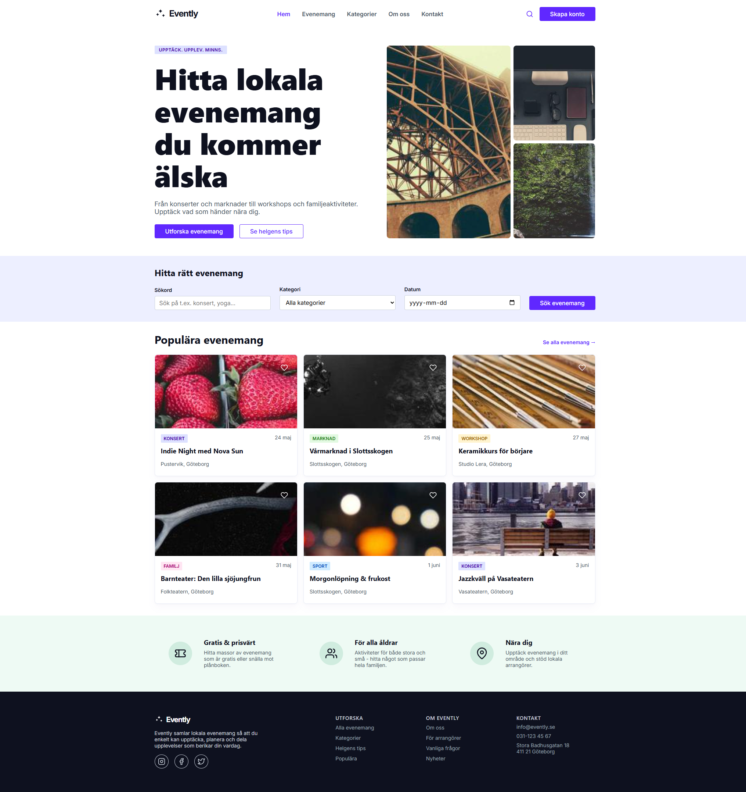
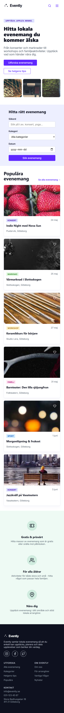

# Inlämningsuppgift Evently
Uppgiften är att göra en sida enligt nedanstående bilder, text och kod-stycken.

## Inlämning
* Code review är efter lunch fredagen den 12/6.
* Senaste tiden för inlämning är kl. 8.00 fredagen den 12/6. Det som kommer efter det bedömmer vi inte om det inte finns rimliga skäl.
* Ni lämnar in genom att ni skriver in en länk till ert Github-repo i ett formulär ni kommer få. OBS: Glöm ej att göra repot publikt!
* När ni lämnat in bedömmer vi koden i det skick den är vid deadline, commits efter detta kommer ignoreras.
* Var beredd på att förklara er kod muntligt, så se till att ni förstår vad ni gör om ni rådfrågar andra/AI.
  
## Krav
* Klona detta repo och använd som grund.
* Använd de variabler ni anser aktuella av de ni får i style.css som grund för sidans design.
* Ni ska lösa uppgiften enligt den design som anges i bilderna.
* Sidan ska vara responsiv och se bra ut oavsett storlek från ca 300px upp till ca 1920px i bredd.
* Formulär, semantik och navigation ska vara tillgängligt (använd WAVE eller dylikt för att testa).
* Koden ska vara välformatterad och tydligt strukturerad med en genomtänkt namngivning på klasser samt ev kommentarer.
* Inga bibliotek som react, bootstrap, tailwind eller dylikt får användas, endast .CSS och .HTML (ev js för hamburgermeny om ni vill göra den, inget annat).
* Om ni lånar en reset, utility eller dylikt som inte finns i grundkoden - ange källa som kommentar i er kod.

## Extra
Följande är extra och sådant ni inte måste ha med om ni inte hinner/vill/kan
* De tre bilderna högst upp kan ha en enklare design, t ex samma design/storlek i alla lägen.
* Hjärta/bookmark/like-knappen på korten är bara om ni vill och hinner.
* Olika färger på "tags" behövs inte om ni inte vill, använd bara en på alla om ni vill förenkla.
* Använd gärna en diskret transition på hover/focus-visible på knappar och länkar om ni vill.
* Hamburgar-menyn behöver ni bara göra som en ikon, all annan funktionalitet är superextra och inget som vi förväntar oss att ni gör!
  
## Övriga resurser
* Använd gärna bilder från [https://picsum.photos/](https://picsum.photos/). Vill ni använda andra är det ok, men se till att det ser bra ut i sammanhanget.
* Vill ni ändra texter och lägga in egen info är det också ok, bara det fyller samma typ av funktion och inte ändrar sidans utseende bortom innehållet.
* Alla ikoner ligger som svg högst upp i html-filen. Om ni vill ändra färger med CSS på SVG måste de vara inkopierade inline. Se här för hur man kan ändra färger med CSS: https://nucleoapp.com/blog/post/change-svg-color-css
* Om ni vill kan ni använda material icons eller dylikt istället för svg (https://fonts.google.com/icons).
* Länkarna ska vara semantiska men behöver inte gå någonstans (använd href="#").

## Code Review (fredag 12/6)
### Tider
* 13.05 Kort gemensamt uppstartsmöte
* 13.15 Möte i grupperna
* 14.30 Återsamling i helklass

### I grupp
Visa och berätta lite om:
* En del av din kod där du fått till en responsiv lösning du är nöjd med.
* Hur du strukturerat din html/css för att få tydlighet, läsbarhet och återanvändbar kod.
* Har du tänkt på tillgänglighet?

### I helklass
Berätta i korthet:
* Vad er grupp tyckte var svårast att få till.
* Något ni lärde er av den här övningen.
  
## Design
Bilderna för designen ligger under Design-mappen och innehåller bilder för de olika vyerna.

### Desktop

### Tablet

### Mobile

